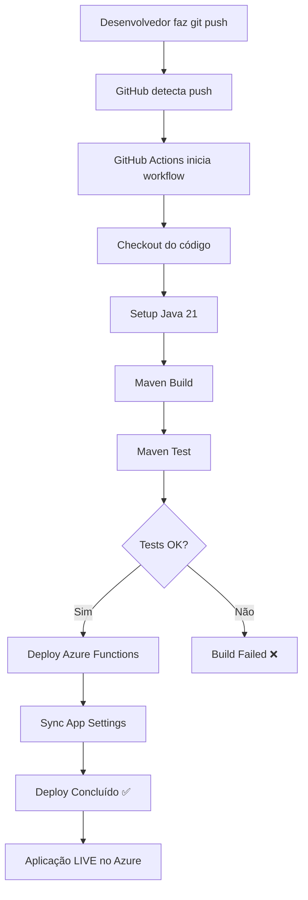

# 🎯 Resumo: Deploy Automático Configurado

## ✅ O que foi feito

### 1. Workflow GitHub Actions Atualizado
📁 Arquivo: `.github/workflows/deploy.yml`

**Melhorias aplicadas:**
- ✅ Java 21 (versão correta do projeto)
- ✅ Nome correto da Function App: `feedbackhub-func`
- ✅ Path correto: `target/azure-functions/feedbackhub-func`
- ✅ Suporte para branch `main` e `master`
- ✅ Execução manual habilitada (workflow_dispatch)

### 2. Script de Automação
📁 Arquivo: `get-publish-profile.sh`

**O que faz:**
- Obtém automaticamente o publish profile do Azure
- Salva em arquivo XML
- Copia para área de transferência (macOS)
- Mostra instruções passo a passo

### 3. Documentação Completa
📁 Arquivo: `CONFIGURAR-DEPLOY-AUTOMATICO.md`

**Conteúdo:**
- Pré-requisitos
- Guia passo a passo detalhado
- Configuração de todos os secrets
- Troubleshooting
- Monitoramento e logs

### 4. Guia Rápido
📁 Arquivo: `DEPLOY-AUTOMATICO-QUICKSTART.md`

**Conteúdo:**
- Quick start em 5 minutos
- Tabela de secrets necessários
- Diagrama de fluxo
- Checklist

### 5. README Atualizado
📁 Arquivo: `README.md`

**Atualização:**
- Adicionadas referências aos novos guias
- Links destacados para deploy automático

---

## 🚀 Como Usar (Resumo)

### Passo 1: Obter Credenciais
```bash
./get-publish-profile.sh
```

### Passo 2: Configurar GitHub Secrets
Acesse: `GitHub → Settings → Secrets and variables → Actions`

Adicione 8 secrets:
1. ✅ `AZURE_FUNCTIONAPP_PUBLISH_PROFILE`
2. ✅ `DB_URL`
3. ✅ `DB_USERNAME`
4. ✅ `DB_PASSWORD`
5. ✅ `AZURE_STORAGE_CONNECTION_STRING`
6. ✅ `SENDGRID_API_KEY`
7. ✅ `ADMIN_EMAILS`
8. ✅ `REPORT_EMAILS`

### Passo 3: Testar
```bash
git add .
git commit -m "test: deploy automático"
git push origin main
```

### Passo 4: Acompanhar
Acesse: `GitHub → Actions → Deploy Azure Functions`

---

## 📊 Fluxo de Deploy Automático



---

## 🎯 Benefícios

### Antes (Manual)
```bash
mvn clean package
mvn azure-functions:deploy
# Aguardar 5-10 minutos
# Verificar manualmente
```

### Agora (Automático)
```bash
git push origin main
# Tudo acontece automaticamente! 🚀
```

**Vantagens:**
- ✅ Zero intervenção manual
- ✅ Testes automáticos
- ✅ Deploy consistente
- ✅ Logs e histórico no GitHub
- ✅ Rollback fácil
- ✅ Configurações centralizadas

---

## 📈 Próximas Melhorias (Opcional)

### 1. Ambientes Múltiplos
```yaml
# Deploy para staging primeiro
branches:
  - develop  → staging
  - main     → production
```

### 2. Testes Automatizados
```yaml
- name: Integration Tests
  run: ./test-functions.sh
```

### 3. Notificações
```yaml
- name: Notify Slack
  if: failure()
  uses: slack/action@v1
```

### 4. Code Quality
```yaml
- name: SonarQube Analysis
  uses: sonarsource/sonarqube-scan-action@master
```

---

## 🔐 Segurança

### ✅ Boas Práticas Implementadas

1. **Secrets no GitHub**
   - Credenciais não estão no código
   - Criptografadas pelo GitHub
   - Acesso restrito

2. **Publish Profile**
   - Rotação automática possível
   - Revogável a qualquer momento
   - Específico para uma Function App

3. **Slot Settings**
   - Secrets críticos isolados
   - Não sobrescritos em deploy

4. **Logs Sanitizados**
   - Secrets mascarados nos logs
   - Histórico auditável

---

## 📚 Arquivos Criados

```
feedbackhub/
├── .github/
│   └── workflows/
│       └── deploy.yml                           ← ✅ Atualizado
├── get-publish-profile.sh                       ← ✅ Novo
├── CONFIGURAR-DEPLOY-AUTOMATICO.md              ← ✅ Novo
├── DEPLOY-AUTOMATICO-QUICKSTART.md              ← ✅ Novo
├── DEPLOY-AUTOMATICO-RESUMO.md                  ← ✅ Este arquivo
└── README.md                                     ← ✅ Atualizado
```

---

## 🎓 O que Você Aprendeu

- ✅ Como configurar GitHub Actions
- ✅ Como fazer deploy automático para Azure
- ✅ Como gerenciar secrets de forma segura
- ✅ Como monitorar deployments
- ✅ Como fazer rollback se necessário
- ✅ Boas práticas de CI/CD

---

## 🆘 Suporte

### Problemas Comuns

| Problema | Onde Procurar |
|----------|---------------|
| Deploy falha | [CONFIGURAR-DEPLOY-AUTOMATICO.md](CONFIGURAR-DEPLOY-AUTOMATICO.md#-troubleshooting) |
| Secrets faltando | [DEPLOY-AUTOMATICO-QUICKSTART.md](DEPLOY-AUTOMATICO-QUICKSTART.md#-secrets-necessários) |
| Workflow não dispara | [CONFIGURAR-DEPLOY-AUTOMATICO.md](CONFIGURAR-DEPLOY-AUTOMATICO.md#deploy-não-dispara-automaticamente) |

### Comandos Úteis

```bash
# Ver status no Azure
az functionapp show --name feedbackhub-func --resource-group feedbackhub-rg

# Ver logs em tempo real
az functionapp log tail --name feedbackhub-func --resource-group feedbackhub-rg

# Testar endpoint
curl https://feedbackhub-func.azurewebsites.net/api/avaliacoes

# Re-obter publish profile
./get-publish-profile.sh
```

---

## 🎉 Conclusão

**Deploy automático está 100% configurado e pronto para uso!**

**Fluxo final:**
1. Você desenvolve localmente
2. Faz commit e push
3. GitHub Actions cuida do resto
4. Aplicação atualizada no Azure em minutos
5. ✅ Pronto para produção!

**Documentação disponível:**
- 📖 Guia completo: [CONFIGURAR-DEPLOY-AUTOMATICO.md](CONFIGURAR-DEPLOY-AUTOMATICO.md)
- ⚡ Quick start: [DEPLOY-AUTOMATICO-QUICKSTART.md](DEPLOY-AUTOMATICO-QUICKSTART.md)
- 🛠️ Script helper: `./get-publish-profile.sh`

---

**Happy Coding! 🚀**

